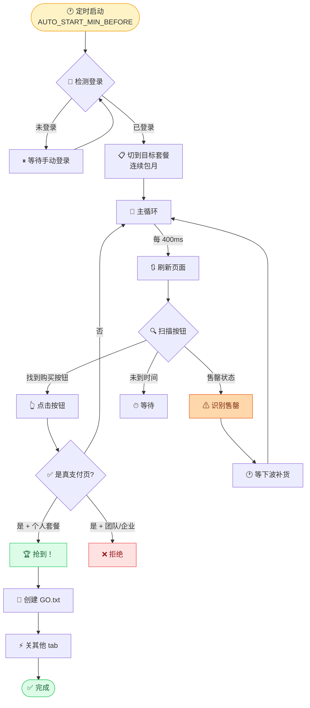

# [](https://github.com/TimeCraker/glm-grab/actions/workflows/ci.yml)

GLM Coding 抢购脚本

> 智谱 GLM Coding 套餐（Lite / Pro / Max）补货时自动抢 — 设好时间就睡，09:58 自动进入高频模式

<p align="center">
  
  
  
  
  
</p>

---

## 🎯 抢购策略全景



**v2 核心优化**（2026-06-18 实战后）：

| 优化点 | v1 | v2 | 效果 |
|--------|----|----|------|
| 并行 tab 数 | 1 | **4** | 命中率 ×4 |
| 刷新间隔 | 800ms | **400ms** | 响应速度 ×2 |
| 按钮文字匹配 | 6 种 | **16 种** | 覆盖所有"立即开通/抢购/抢"变体 |
| 售罄识别 | 无 | **6 种关键词** | 区分"今日售罄 vs 等下波补货" |
| 真支付页判断 | URL 字符串 | **三重检查** | 过滤团队/企业版误报 |
| 触发协调 | 无 | **GO.txt 信号** | 一个 tab 抢到 → 其他 tab 立刻关 |

---

## ✨ 特性

- 🎯 **多 tab 并行**：4 个 tab 同时抢（推荐 3-5，越多越快但越容易被 ban）
- ⏰ **自动定时启动**：设好 `RESTOCK_TIME` 就睡，提前 N 分钟自动进入高频模式
- 🔍 **智能按钮匹配**：覆盖 16 种中文/英文购买按钮文案
- 🚫 **三重支付页校验**：过滤团队/企业版误报，只抢个人套餐
- 📢 **触发文件协调**：赢家通过 `GO.txt` 信号通知其他 tab 关闭
- 🧠 **售罄智能识别**：区分"今日售罄"和"等下波补货"，避免无效重试
- 🛡 **登录态检测**：自动识别登录/未登录，未登录时等待

---

## 🚀 快速开始

### 前置

- Python 3.8+
- Playwright（`pip install playwright` 后 `playwright install chromium`）
- 智谱 GLM Coding 账号（已登录的 Chrome profile）

### 安装

```bash
cd glm-grab
pip install playwright
playwright install chromium
```

### 配置（编辑 `grab.py` 顶部）

```python
# ===================== 你要改的 =====================
PLAN = "Pro"                  # 套餐: "Lite" / "Pro" / "Max"
RESTOCK_TIME = "10:00:00"     # 补货时间（24h 制）
AUTO_START_MIN_BEFORE = 2     # 提前几分钟开始刷（推荐 1-3）
TAB_COUNT = 4                 # 并行 tab 数（推荐 3-5）
REFRESH_INTERVAL = 0.4        # 页面刷新间隔（秒）
SCAN_INTERVAL = 0.1           # 按钮扫描间隔（秒）
```

### 启动 Chrome（首次需手动登录）

```bash
# 用 Playwright 自带的 Chromium 启动并登录智谱账号
python -c "
from playwright.sync_api import sync_playwright
with sync_playwright() as p:
    browser = p.chromium.launch_persistent_context(
        './glm_profile',
        headless=False,
    )
    page = browser.pages[0]
    page.goto('https://bigmodel.cn/glm-coding')
    input('登录完成后按回车...')
    browser.close()
"
```

> **重要**：`./glm_profile` 目录会保存登录态，**已在 `.gitignore` 中**（223MB Chrome profile 不能进仓库）。

### 运行

```bash
python grab.py
# 设好 RESTOCK_TIME 和 TAB_COUNT，去睡觉
```

到点脚本会：
1. 提前 `AUTO_START_MIN_BEFORE` 分钟开始高频刷新
2. 4 个 tab 并行扫描"购买"按钮
3. 一个 tab 抢到 → 立即写 `GO.txt` → 其他 tab 检测到信号 → 立刻关闭
4. 整个过程打印详细日志

---

## 🏗 三重支付页校验（避免误报）

```python
# grab.py 中的 is_payment_url() 三重检查
# 1. 拒绝: URL 含 team/enterprise/团队/企业 → 绝对误报
# 2. 域名变了 + 是 alipay/wxpay/tenpay → 真支付页
# 3. 仍在 bigmodel.cn 下,路径含 order/checkout/pay + 不是 /glm-coding + 不是 team → 真个人支付页
```

| URL 模式 | 判定 | 原因 |
|----------|------|------|
| `bigmodel.cn/glm-coding/...` | ❌ 拒绝 | 还在套餐页,没跳走 |
| `checkout.bigmodel.cn/team/...` | ❌ 拒绝 | 团队版,不是个人套餐 |
| `alipay.com/.../pay/...` | ✅ 通过 | 跳到支付宝支付页 |
| `wxpay.wx.qq.com/...` | ✅ 通过 | 跳到微信支付页 |
| `bigmodel.cn/checkout/personal/...` | ✅ 通过 | 站内个人支付页 |

---

## 🛠 关键参数调优

| 参数 | 保守值 | 推荐值 | 激进值 | 说明 |
|------|--------|--------|--------|------|
| `TAB_COUNT` | 2 | **4** | 6 | 并行 tab 数,越多越快但越容易被 ban |
| `REFRESH_INTERVAL` | 0.8s | **0.4s** | 0.2s | 刷新间隔,越短响应越快 |
| `SCAN_INTERVAL` | 0.2s | **0.1s** | 0.05s | DOM 扫描间隔 |
| `AUTO_START_MIN_BEFORE` | 5 | **2** | 1 | 提前启动时间 |

> ⚠️ 激进值可能触发智谱风控（IP 临时封禁），建议从推荐值开始。

---

## 📁 文件结构

```
glm-grab/
├── grab.py                 # 主脚本（381 行，含所有抢购逻辑）
├── glm_profile/            # Chrome 持久化 profile（git ignore,223M）
│   ├── Default/
│   ├── Crashpad/
│   ├── BrowserMetrics-spare.pma
│   └── ...                 # Playwright 启动时创建
├── GO.txt                  # 触发文件（其他 tab 抢到时创建）
└── README.md
```

---

## 🛡 法律与合规

- ⚠️ **仅供学习研究**：本脚本仅用于个人抢购场景
- ⚠️ **遵守平台协议**：使用前请阅读智谱 GLM Coding 用户协议
- ⚠️ **不保证 100% 抢到**：高并发场景下，平台可能限流或封号
- ⚠️ **风险自担**：因使用本脚本造成的任何后果，由使用者承担

---

## 📄 License

MIT © TimeCraker
